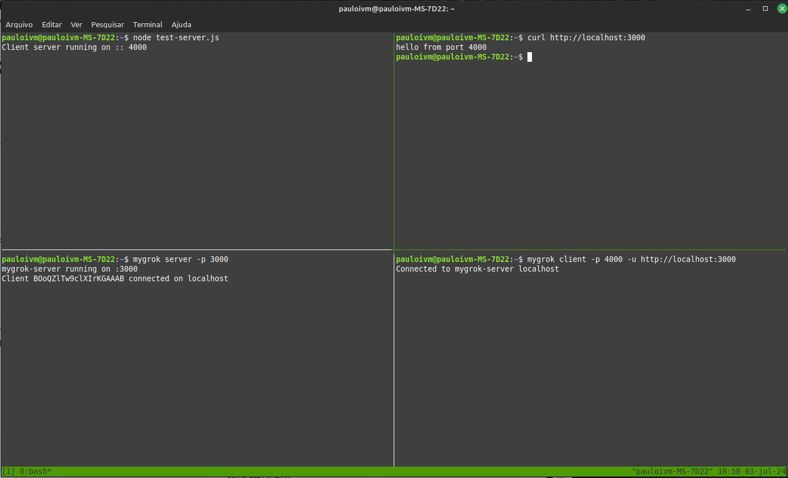

# myGrok    :computer: :telephone_receiver: :computer:

## Sumário

- [Introdução](#introdução)
- [Instalação](#instalação)
- [Tutorial/Exemplos](#tutorialexemplos)
- [Motivação](#motivação)

## Introdução

Esta é uma ferramenta de tunelamento para ajudá-lo a reduzir custos de infraestrutura.

Fortemente inspirado no `nGrok`, o `myGrok` também é uma ferramenta de tunelamento, contudo com o diferencial de estabelecer os **túneis de ponta a ponta**. A ideia é executá-la do lado do(s) servidor(es) local(ais) e também do lado de um servidor hospedado (com um ip fixo ou um domínio).

Os túneis do `myGrok` possuem um caráter mais duradouro. Ou seja, se você pode manter um servidor hospedado com túneis para outros servidores com IPs dinâmicos por vários dias, meses ou anos. Isto pois o `myGrok` conta com um sistema de re-conexão caso a disponibilidade dos servidores locais/dinâmicos caiam por um curto período de tempo (seja devido ao provedor de internet trocar o IP, ou realmente uma queda temporária de internet).

O tunelamento é feito com uma criptografia simétrica, trazendo segurança contra qualquer ataque middle-man. Além de um token (também criptografado), que pode ser passado para impedir que terceiros se conectem aos seus túneis (o que seria indesejável, pois, ainda que este não conseguisse descriptografar os dados, iria bloquear a sua conexão).

Para saber mais sobre os casos de uso mais indicados para a lib, confira em [Motivação](#motivação).

## Instalação

Para usar a lib como um CLI, basta executar:

```shell
npm i -g mygrok
```

Caso queira incorporar a lib em um projeto, pode também instalar ao projeto sem a flag `-g`.

## Tutorial/Exemplos

O `myGrok` conta com um comando para ser executado na aplicação hospedada e um segundo comando para executar em uma ou mais aplicações locais (as aplicações que você deseja expor pelos túneis).

O comando para rodar do lado hospedado é o `mygrok server <...options>` e o comando do lado local é o `mygrok client <...options>`.

Para o comando `mygrok server`, os seguintes parâmetros podem ser passados:

| Opção | Argumento | Descrição | Exemplo |
|--------|--------|--------|--------|
| `-h` | `<server-hosts>` | Hosts disponíveis para clientes se conectarem por um túnel. | `-h foo.org,bar.org` |
| `-p` | `<server-port>` | Porta em que o `mygrok-server` receberá conexões. | `-p 3000` |
| `-r` | `<reconnection-timeout>` | Tempo máximo para reconexão de um client à um host do `mygrok-server` em milissegundos. | `-r 8000` |
| `-t` | `<token>` | Token para autenticação dos sockets. | `-t my_token` |
| `-s` | `<secret-key>` | SecretKey para criptografia dos dados trafegados nos túneis. Deve ser passado uma string de exatamente 32 caracteres. | `-s T8s9G4j6M1x2D7p0W3q5B8z4L7v1N6k3` |

Para o comando `mygrok client`, os seguintes parâmetros podem ser passados:

| Opção | Argumento | Descrição | Exemplo |
|--------|--------|--------|--------|
| -h | `<server-host>` | Um dos hosts disponíveis passados no server para se conectar. | `-h foo.org` |
| -u | `<server-url>` | Url de conexão do server. | `-u https://foo.org` |
| -p | `<client-port>` | Porta que o `mygrok-client` tentará expor ao `mygrok-server`. | `-p 4000` |
| -l | `<client-hostname>` | Hostname que o `mygrok-client` tentará expor ao `mygrok-server` | `-l 0.0.0.0` |
| -t | `<token>` | Token para autenticação dos sockets. | `-t my_token` |
| -s | `<secret-key>` | SecretKey para criptografia dos dados trafegados nos túneis. Deve ser passado uma string de exatamente 32 caracteres. | `-s T8s9G4j6M1x2D7p0W3q5B8z4L7v1N6k3` |

Vale ressaltar que a autenticação e a criptografia são simétricas. Ou seja, você deve passar o mesmo `-t` e `-s` no `mygrok client` e no `mygrok server`.

Uma observação: não é extritamente necessário que você passe um `token`, pois, dado a criptografia, a conexão dos sokects só será estabelecida caso o `mygrok client` tenha a secret-key para criptografar devidamente o token. Então, na prática você poderia não passar um `token` e seria usado um `token` default hard-coded. Contudo, é interessante passar um token único, para adicionar mais uma camada de segurança.

Já o `secret-key`, é muito importante que você informe uma chave única, criada por você mesmo e não compartilhada, de 32 caracteres. Isso garantirá que os dados trafegados nos túneis estejam criptografados, e, caso haja algum proxy intermediário entre o seu `mygrok client` e o `mygrok server`, ele não terá conhecimento das informações trafegadas.

A flag `-l` do `mygrok client` é opcional; por padrão o valor será `localhost`; mas dependendo do caso você pode querer passar outro host, como um `0.0.0.0` ou até mesmo um host de um domínio terceiro, caso queira expor uma aplicação de um domínio qualquer (por exemplo, se você passar `-p 8080 -l google.com`, você estaria tentando expor o site do google via túnel no seu `mygrok server`, o que é claro, o google não aceitará uma conexão não segura).

### Hello world

Para um primeiro exemplo, crie um arquivo `test-server.js` com o código a seguir:

```js
const http = require("http");
const PORT = 4000;
const server = http.createServer((req, res) => {
    req.on("data", () => {}).on("end", () => {
        res.end(`hello from port ${PORT}`);
    });
});
server.listen(PORT, () => {
    console.log(`Client server running on :: ${PORT}`);
});
```

Execute o script criado:

```shell
node test-server.js
```

Este será um server genérico, que poderíamos estar querendo expor em outra máquina através do tunelamento do `myGrok`.

Abra um terminal e digite:

```shell
mygrok server -p 3000
```

Em outro terminal, insira:

```shell
mygrok client -p 4000 -u http://localhost:3000
```

Agora, se fizermos um `curl` para `http://localhost:3000`, veremos o servidor em `JS` que subimos na porta 4000 respondendo.

TODO: Pegar uma imagem melhor... depois deu ter publicado a lib... ou um gif...


Repare que o servidor está rodando na porta 4000, mas estamos acessando na porta 3000 devido ao `myGrok` estar fazendo o tunelamento que configuramos com os dois comandos executados.

É claro que, até então, estamos rodando tudo localmente e no mesmo host, o que pode não deixar tão evidente o propósito da lib. Então vamos para alguns usos mais interessantes.

### Rodando múltiplos clientes

Vamos supor que você tenha à disposição algo como um EC2 e um AWS Route 53. Então, vamos supor que você tenha direcionado vários subdomínios para esse EC2, e deseje que cada subdomínio conecte-se a um processo local distinto.

Neste caso, você pode utilizar a flag `-h` no `mygrok server` e no `mygrok client`. No server, você pode passar vários hosts, que são os hosts disponíveis para os clients se conectarem. Cada host pode permanecer conectado a um único client; e se você tentar estabeler uma conexão de um client a um host já conectado a outro client, então o handshake falhará.

Para simularmos esse caso, mas ainda rodando tudo localmente, podemos alterar o `/etc/hosts`, adicionando mais hosts locais. Quando você abrir este arquivo, é provável que encontre a linha `127.0.0.1 localhost` preenchida; assim, vamos adicionar outros hosts conforme a seguir neste arquivo:

```
127.0.0.1 localhost
127.0.0.1 server-a
127.0.0.1 server-b
127.0.0.1 server-c
```

Adicionados estes hosts, agora rode três servidores JS, semelhante ao que fizemos no exemplo anterior, cada um em uma ports diferente. Vamos supor que você tenha inicializado um na porta 4000, outro na 4001 e outro na 4002.

Agora, podemos rodar o `server` da seguinte forma:

```shell
mygrok server -h server-a,server-b,server-c -p 3000
```

E rodamos os túneis de cada um dos clients:

```shell
mygrok client -h server-a -p 4000 -u http://localhost:3000
```

```shell
mygrok client -h server-b -p 4001 -u http://localhost:3000
```

```shell
mygrok client -h server-c -p 4002 -u http://localhost:3000
```

E pronto. Acessando no seu navegador `http://server-a:3000`, será feito o proxy para o servidor local rodando na porta 4000. Se acessar a url com o server-b, para a 4001, e assim por diante.

**IMPORTANTE**: Lembre-se se passar um secret-key válido para garantir a criptografia dos dados enviados nos túneis.

### Exemplo na AWS com EC2 e Route 53

TODO: Gravar um vídeo... mostrar tbm outros aspectos como a re-conexão... secret-key e etc.

## Motivação

Os serviços cloud facilitaram muito a hospedagem de serviços web; contudo, em muitos casos, os custos podem ser desanimadores, em especial se o seu software ainda não for monetizado e você não tiver dinheiro sobrando.

Nestes casos, existem algumas soluções gratuitas bastante interessantes, por exemplo:
- [ngrok](https://ngrok.com/)
- [duckdns](https://www.duckdns.org/)

Serviços como o `ngrok` permitem facilmente você criar um tunnel diretamente do seu computador pessoal para a web. Serviços de `ddns`, como o `duckdns`, permitem que você suba um servidor local utilizado um ip dinâmico, e, sempre que o seu ip mudar, este serviço irá perceber isso e fazer um proxy devidamente, ou informar ao cliente o novo endereço IP.

### Então, qual a utilidade deste projeto?

Imagine que você queira testar um MVP, e deixar um site no ar por alguns dias. Ou que você queira subir um portifólio pro ar.

Ainda assim, é possível usar o `ngrok`, não? Na modalidade gratuita, uma hora o seu túnel irá morrer, e a aplicação irá parar de funcionar; fora que a url fornecida costuma ser no domínio `ngrok`, gerando apenas um sub-domínio específico para a sua aplicação. Isso pode ser ruim se o seu caso for testar um MVP; por exemplo, e se o seu site depender minimamente de SEO? E se você quiser testar um projeto por algum tempo, sem gastar muito, e só depois decidir se vai investir em uma infra mais cara?

Certo, mas então esses serviços de `ddns` certamente funcionariam, não? A desvantagem de você não ter um domínio seu pode continuar sendo um problema. Além disso, dependendo do seu provedor de internet, você pode acabar tendo problemas se o seu provedor usar estratégias de CGNAT. Com isso quero dizer que o seu provedor pode estar usando um mesmo IP público para vários clientes (e cada cliente com um IP privado na rede do provedor), e isso dificultaria muito o servidor `ddns` fazer o proxy para o seu servidor local. Nestes casos de CGNAT, o ideal é algo baseado em tunelamento, como o `ngrok`. 

Ok. Num caso onde eu não posso recorrer a nem um `ngrok` e nem a um `duckdns`, é inevitável que eu tenha que recorrer à serviços cloud ou montar minha infra on-premise. No que este projeto seria útil então?

Neste cenário, o `myGrok` seria útil para **reduzir** os custos de cloud (repare, reduzir, e não eliminar por completo).

Imagine que você tenha um projeto ReactJS/NextJS, e cerca de duas ou três apis, mais um banco de dados. Este é o MVP que deseja subir para a nuvem. O EC2 `t2.micro`, que é uma máquina gratuita oferecida pela AWS, possui apenas 1GB de memória RAM; é possível que isso não rode nem mesmo sua aplicação ReactJS. Se você for alugar mais máquinas, no momento em que eu escrevo esse readme, as instâncias mais baratas custam cerca de 6 dólares; facilmente seu projeto pode acabar saindo bem caro para um simples MVP ou portifólio.

Ainda nessa linha, o meu computador pessoal é um Intel Core I5 de 32GB de RAM. Uma máquina AWS mais ou menos equivalente, o `t3.2xlarge`, de 32GB, neste momento custa USD 0,3328 a hora, que nos dá **cerca de 240 dólares por mês!!**

Então, chegamos no caso de uso mais indicado para o `myGrok`. Imagine que você tenha uma máquina local potente, com a possibilidade de deixá-la ligada 24/7. Você deseja subir para produção um projeto razoavelmente complexo, que demande um consumo considerável de RAM e processamento. Você precisa, ou deseja, subir em um domínio próprio.

Ao invés de alugar uma máquina potente como o `t3.2xlarge`, você poderia alugar um único `t2.micro` e criar vários túneis apontando para apis rodando no seu servidor local. Em outras palavras, o `myGrok` te permite alugar **apenas** os serviços de rede, mas reduzindo custos computacionais dado o uso de máquinas próprias.

Ou seja, o cenário ideal para o `myGrok` é quando se deseja alugar apenas recursos de rede, mas não recursos computacionais, ainda que o provedor cloud queira te vender tudo junto em um mesmo pacote.

## TODOs

- [ ] Possibilitar transmitir os cada chunk de uma stream em uma mensagem distinta do socket.
- [ ] Cria readme em inglês;
- [ ] Criar testes automatizados;
- [ ] Criar exemplo com um t2.micro e aws route 53 com múltiplos subdomains;
- [ ] Gravar um vídeo com estes exemplos, e mostrando tbm a perda de conectividade, em especial usando uma máquina virtual para os servidores locais e cortando a conexão por algum tempo;
